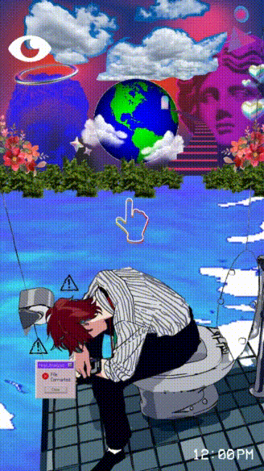

  <dd>
    <dl>
      <dd>
        
      </dd>
    </dl>
  </dd>

<dl>
  <dd>
    

       
       
       - 👋 Hi, I’m Kang Te-Oh (Not my real name)
       - 👀 I’m interested in art, music, writing, video games, and programming
       - 🌱 I’m currently learning: 
        
       - 🕹️ Working on: "Truth in Fragments"(VN), "The Hospital Visit"(RPG)
       - 📫 How to reach me: kangteoh19@gmail.com, saltwithglasses@gmail.com, 
             @saltwithglasses on fb, twitter, instagram, youtube, and itch.io
       - 😄 Pronouns: you can use any of them
       - ⚡ Fun fact: tomatoes are fruits but are considered vegetables for culinary purposes
    

  </dd>
</dl>

   
   
   
  

<!---
kang1Oh/kang1Oh is a ✨ special ✨ repository because its `README.md` (this file) appears on your GitHub profile.
You can click the Preview link to take a look at your changes.
--->
